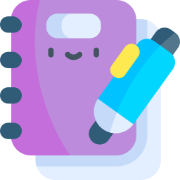

<!-- PROJECT LOGO -->
 

  

  <h3 align="center">Discover Inner You</h3>

  

    Your App for Monitoring Emotion
     
    <a href="mailto:madeadisujaya23@gmail.com">View Demo</a>
    ·
    <a href="mailto:madeadisujaya23@gmail.com">Request Feature</a>
  

<!-- TABLE OF CONTENTS -->

  
Table of Contents

  <ol>
    <li>
      <a href="#about-our-project">About Our Project</a>
    </li>
    <li>
      <a href="#our-tools">Our Tools</a>
    </li>
    <li>
      <a href="#process-of-developing-app-until-production">Process of Developing App until Production</a>
      <ul>
        <li><a href="#machine-learning-path-process">Machine Learning Path Process</a></li>
        <li><a href="#cloud-computing-path-process">Cloud Computing Path Process</a></li>
        <li><a href="#mobile-development-path-process">Mobile Development Path Process</a></li>
      </ul>
    </li>
    <li><a href="#contact">Contact</a></li>
    <li><a href="#references">References</a></li>
  </ol>

<!-- ABOUT THE PROJECT -->

## **About Our Project**

These days, more and more individuals are experiencing emotional challenges such as stress and anxiety. However, access to resources that support self-exploration and mental health is still limited. Many people have difficulty in understanding their emotional state due to the lack of tools that can help them recognize and manage their moods independently. Discover Inner You is designed to fill this gap by providing tools that analyze users' feelings based on their daily notes. As such, the app aims to empower users to understand and manage their emotional state, as well as provide recommendations that can support their mental well-being.

    
    
    
    
    
    
    
    

## **Our Tools**

This section should list any major frameworks/libraries used to bootstrap your project. Leave any add-ons/plugins for the acknowledgements section. Here are a few examples.

ML Path:

- Tensorflow
- Visual Studio Code
- Codespace
- Kaggle
- Google Colab
- Flask
- Git/Github
- Docker

CC Path:

- Visual Studio Code
- Node.js
- Google Cloud App Engine or Google Cloud Compute Engine
- Google Cloud Storage
- Google Cloud SQL
- Postman
- Git/Github

MD Path:

- Android Studio
- Postman
- Figma
- Retrofit
- Git/Github
- Kotlin

<!-- GETTING STARTED -->

## **Process of Developing App until Production**

### **Machine Learning Path Process**

1. **Data Collection**  
   Source data from Kaggle for text classification tasks.

2. **Preprocessing**

   - Normalize text.
   - Remove special characters.
   - Encode labels into numeric format.

3. **Tokenization**  
   Use `tensorflow.keras.preprocessing.text.Tokenizer` to tokenize text into sequences.

4. **Model Development**

   - Build a model with:
     - Input layers.
     - Word2Vec embedding.
     - Bidirectional LSTM.
   - Train and evaluate the model using metrics like accuracy and F1-score.

5. **Model Saving**  
   Save the trained model using `model.save()`.

6. **Deployment**

   - Containerize the model using Docker.
   - Implement a Flask API to expose it for predictions.

7. **Testing**  
   Test the Flask API using Postman to validate prediction accuracy and functionality.

### **Cloud Computing Path Process**

1. **Cost and Resource Estimation**

   - **Resource Estimation**: Define server requirements (CPU, GPU, RAM, storage) based on the model complexity and expected request volume.
   - **Cost Estimation**: Use Google Cloud’s pricing calculator to estimate costs for services like Compute Engine, AI Platform, or Cloud Functions.

2. **Model Management on the Server**

   - Deploy the Docker container using services like Cloud Run or Google Kubernetes Engine (GKE).
   - Use Artifact Registry to store and manage Docker images.
   - **Monitoring**: Track server performance and resource usage with Cloud Monitoring.
   - **Scaling**: Enable auto-scaling to dynamically manage high loads.

3. **API Development**
   - Connect the Docker container to a REST API endpoint.
   - Secure the API with authentication mechanisms (e.g., OAuth, API Keys) and enforce HTTPS.
   - Implement logging to track errors and monitor API performance.

### Mobile Development Path Process

1. **Design in Figma**

   - Create wireframes and interactive prototypes in Figma.
   - Ensure the design is user-friendly, with intuitive navigation and visually appealing elements.

2. **Development in Android Studio**
   - Implement the UI in XML based on the Figma design.
   - Connect the UI to the backend API to fetch data or send inputs.
   - Optimize app performance by utilizing features like lazy loading to improve responsiveness.

<!-- CONTACT -->

## Contact

| Name                      |  Path  | Email                     |
| :------------------------ | :----: | :------------------------ |
| Anak Agung Citra Maharani | **ML** | agungcitra0103@gmail.com  |
| Azhar Albaaqi Fadhullah   | **ML** | azharfadullah@gmail.com   |
| I Gede Dwiky Prasetya     | **ML** | dwikiyus4@gmail.com       |
| Satria Sukma Auraly       | **CC** | satriasauraly@gmail.com   |
| Elsa Yonata Sugiono       | **CC** | elsayonata@gmail.com      |
| Kadek Bisma Dharmasena    | **MD** | bisma2412@gmail.com       |
| I Made Adi Sujaya         | **MD** | madeadisujaya23@gmail.com |

<!-- ACKNOWLEDGMENTS -->

## References

- [Source emotion dataset](https://www.kaggle.com/datasets/nelgiriyewithana/emotions)

(<a href="#readme-top">back to top</a>)

